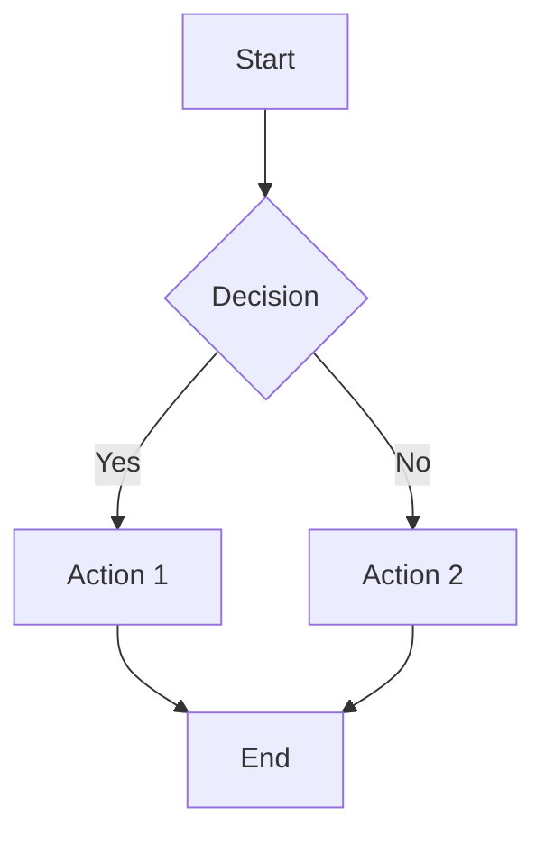

# Markdown to PDF Converter

A powerful Python tool that converts Markdown files to beautifully formatted PDF documents with support for Mermaid diagrams, code syntax highlighting, and GitHub Flavored Markdown features.

## ✨ Features

- **📄 Markdown to PDF Conversion**: Convert any Markdown file to professional PDF documents
- **🎨 GitHub Flavored Markdown**: Full support for GFM features including tables, fenced code blocks, and more
- **📊 Mermaid Diagrams**: Automatic rendering of Mermaid diagrams to PNG images in PDF
- **💻 Code Syntax Highlighting**: Beautiful syntax highlighting for code blocks with language detection
- **🔗 Clickable Links**: Automatic conversion of URLs to clickable links
- **🖼️ Image Support**: Automatic image inclusion with proper scaling and aspect ratio preservation
- **📱 Responsive HTML Output**: Generate clean HTML files alongside PDF conversion
- **🎯 Pure Python**: No external dependencies for PDF generation (uses ReportLab)
- **⚡ Fast Processing**: Efficient conversion with temporary file cleanup

## 🚀 Quick Start

### 1. Create Virtual Environment

```bash
# Create virtual environment
python -m venv .venv

# Activate virtual environment
# On macOS/Linux:
source .venv/bin/activate
# On Windows:
.venv\Scripts\activate
```

### 2. Install Dependencies

```bash
pip install -r requirements.txt
```

### 3. Run the Converter

```bash
# Convert README.md to PDF (default)
python builddoc.py

# Convert specific file
python builddoc.py myfile.md

# Specify output file
python builddoc.py myfile.md -o output.pdf
```

## 📋 Requirements

### Python Packages (Auto-installed)
- `markdown==3.5.1` - Markdown processing with code block support
- `reportlab==4.0.7` - Pure Python PDF generation
- `beautifulsoup4==4.12.2` - HTML parsing for better conversion
- `pygments==2.16.1` - Syntax highlighting for code blocks

### Optional (for Mermaid diagrams)
- `mermaid-cli` - Install globally with: `npm install -g @mermaid-js/mermaid-cli`

## 🎯 Usage Examples

### Basic Usage
```bash
# Convert README.md to README.pdf
python builddoc.py

# Convert any markdown file
python builddoc.py documentation.md

# Specify custom output name
python builddoc.py notes.md -o my_notes.pdf
```

### Supported Markdown Features

#### Code Blocks with Syntax Highlighting
````markdown
```python
def hello_world():
    print("Hello, World!")
    return "success"
```
````

#### Tables
```markdown
| Feature | Status | Description |
|---------|--------|-------------|
| PDF Export | ✅ | Working |
| Mermaid | ✅ | Working |
| Code Highlighting | ✅ | Working |
```

#### Mermaid Diagrams
````markdown

````

#### Links and Images
```markdown
[Visit GitHub](https://github.com)

```

## 🛠️ Advanced Features

### Mermaid Diagram Support
The tool automatically detects Mermaid diagrams in your Markdown and renders them as PNG images in the PDF. Make sure you have `mermaid-cli` installed:

```bash
npm install -g @mermaid-js/mermaid-cli
```

### Custom Styling
The generated PDFs include:
- Professional typography with proper spacing
- Syntax-highlighted code blocks
- Responsive table layouts
- Clickable links with blue highlighting
- Proper image scaling and aspect ratio preservation

### HTML Output
Alongside PDF generation, the tool also creates a clean HTML file with:
- Modern CSS styling
- Responsive design
- GitHub-like appearance
- Proper code highlighting

## 📁 File Structure

```
logmonitor/
├── builddoc.py          # Main converter script
├── requirements.txt      # Python dependencies
├── README.md           # This file
└── .venv/              # Virtual environment (created by you)
```

## 🔧 Troubleshooting

### Common Issues

1. **Missing mermaid-cli**: If Mermaid diagrams aren't rendering, install mermaid-cli:
   ```bash
   npm install -g @mermaid-js/mermaid-cli
   ```

2. **Permission errors**: Make sure you have write permissions in the output directory

3. **Image not found**: Ensure image paths in your Markdown are correct and relative to the Markdown file

### Error Messages
- `Missing required package`: Run `pip install -r requirements.txt`
- `Input file not found`: Check the file path and ensure the file exists
- `Failed to render Mermaid diagram`: Install mermaid-cli or check diagram syntax
