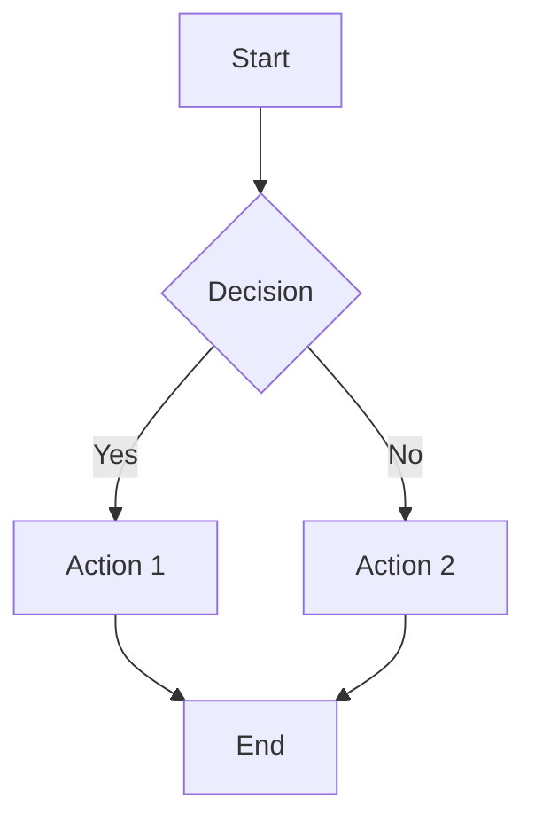
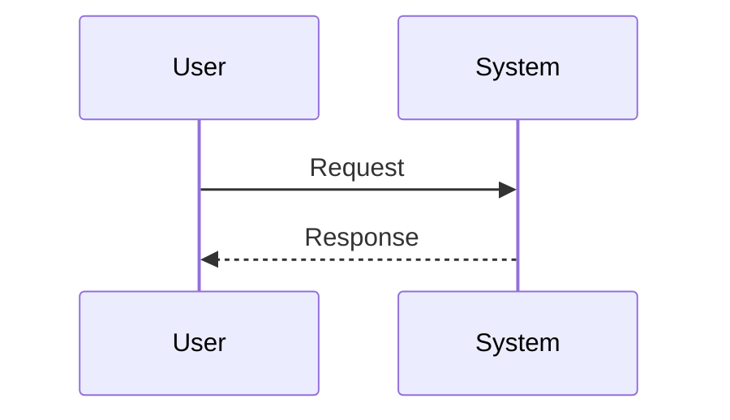

# BuildDoc 📄

A modern, JavaScript-powered Markdown to PDF converter with advanced features including Mermaid diagram support, syntax highlighting, and professional styling.

## ✨ Features

### 🎯 Core Functionality
- **Markdown to PDF Conversion**: Convert any Markdown file to professionally formatted PDF
- **JavaScript-Based Processing**: Uses modern web technologies for accurate rendering
- **Chrome Headless Integration**: Leverages Chrome's rendering engine for high-quality output
- **Cross-Platform Support**: Works on macOS, Linux, and Windows

### 🎨 Advanced Rendering
- **GitHub Markdown Styling**: Uses GitHub's official CSS for authentic documentation appearance
- **Syntax Highlighting**: Powered by Prism.js with support for 200+ programming languages
- **Mermaid Diagram Support**: Renders complex diagrams, flowcharts, and sequence diagrams
- **Badge Rendering**: Properly displays GitHub-style badges and shields
- **Image Optimization**: Automatically handles and optimizes images for PDF output

### 🔧 Technical Features
- **Template-Based Architecture**: Uses customizable HTML templates for consistent output
- **Asset Management**: Automatically copies referenced images and files
- **JavaScript Escaping**: Robust handling of special characters and Unicode content
- **Error Handling**: Comprehensive error reporting and graceful failure handling
- **Temporary File Management**: Clean workspace management with automatic cleanup

### 📱 Output Quality
- **Professional Layout**: Clean, readable formatting optimized for documentation
- **Print Optimization**: Specialized CSS for high-quality PDF generation
- **Responsive Design**: Adapts to different content types and sizes
- **Typography**: Uses system fonts for optimal readability across platforms

## 🚀 Quick Start

### Prerequisites
- Python 3.6+
- Chrome or Chromium browser
- Internet connection (for CDN resources)

### Installation

1. **Clone the repository**:
   ```bash
   git clone <repository-url>
   cd builddoc
   ```

2. **Install dependencies**:
   ```bash
   pip install -r requirements.txt
   ```

3. **Install Chrome/Chromium** (if not already installed):
   
   **macOS**:
   ```bash
   brew install --cask google-chrome
   # OR
   brew install chromium
   ```
   
   **Ubuntu/Debian**:
   ```bash
   sudo apt-get install google-chrome-stable
   # OR
   sudo apt-get install chromium-browser
   ```

### Basic Usage

Convert a Markdown file to PDF:
```bash
python builddoc.py README.md
```

Specify custom output file:
```bash
python builddoc.py README.md -o documentation.pdf
```

Convert any Markdown file:
```bash
python builddoc.py path/to/your/file.md
```

## 📖 Detailed Usage

### Command Line Options

```bash
python builddoc.py [file] [-o OUTPUT]
```

- `file`: Input Markdown file (default: `README.md`)
- `-o, --output`: Output PDF file path (optional)

### Supported Markdown Features

#### Standard Markdown
- Headers (H1-H6)
- Bold and italic text
- Lists (ordered and unordered)
- Links and images
- Code blocks and inline code
- Tables
- Blockquotes
- Horizontal rules

#### Extended Features
- **Mermaid Diagrams**: Use ````mermaid` code blocks for diagrams
- **Syntax Highlighting**: Automatic language detection for code blocks
- **GitHub Flavored Markdown**: Tables, strikethrough, task lists
- **Badge Support**: GitHub-style badges and shields
- **Image Optimization**: Automatic image sizing and positioning

### Example Mermaid Diagrams





## 🏗️ Architecture

### Core Components

1. **ModernMarkdownToPDFConverter**: Main conversion class
2. **Template System**: HTML template with embedded JavaScript
3. **Asset Management**: File copying and reference handling
4. **Chrome Integration**: Headless browser for PDF generation

### Processing Pipeline

1. **Input Validation**: Check file existence and format
2. **Template Preparation**: Copy template and assets to working directory
3. **Content Processing**: Escape and embed Markdown content
4. **HTML Generation**: Create self-contained HTML document
5. **PDF Conversion**: Use Chrome headless for final conversion
6. **Cleanup**: Remove temporary files and directories

### JavaScript Libraries Used

- **Marked.js**: Markdown parsing and conversion
- **Mermaid.js**: Diagram rendering
- **Prism.js**: Syntax highlighting
- **GitHub Markdown CSS**: Professional styling

## 🛠️ Customization

### Template Modification

The `template.html` file can be customized to:
- Change styling and layout
- Add custom CSS
- Modify JavaScript behavior
- Include additional libraries

### Configuration Options

Key configuration variables in the template:
- `mermaidTheme`: Mermaid diagram theme
- `mermaidWaitTime`: Timeout for diagram rendering
- CSS styling for different content types

### Advanced Usage

For programmatic usage:

```python
from builddoc import ModernMarkdownToPDFConverter

converter = ModernMarkdownToPDFConverter('input.md', 'output.pdf')
converter.convert()
```

## 🔍 Troubleshooting

### Common Issues

**Chrome not found**:
- Ensure Chrome/Chromium is installed
- Check PATH environment variable
- Try specifying full path to Chrome executable

**Missing dependencies**:
```bash
pip install -r requirements.txt
```

**Permission errors**:
- Ensure write permissions in output directory
- Check file system permissions

**Large files**:
- Increase Chrome timeout settings
- Consider breaking large documents into sections

### Debug Mode

Enable verbose output by modifying the script to add debug prints or use:
```bash
python -u builddoc.py input.md 2>&1 | tee debug.log
```

## 📋 Requirements

### System Requirements
- Python 3.6 or higher
- Chrome or Chromium browser
- 100MB free disk space (for temporary files)
- Internet connection (for CDN resources)

### Python Dependencies
- `requests`: HTTP requests for online services
- Standard library modules: `argparse`, `os`, `re`, `subprocess`, `sys`, `tempfile`, `shutil`, `pathlib`

### Browser Requirements
- Chrome 80+ or Chromium 80+
- Headless mode support
- PDF generation capabilities

### Development Setup

```bash
git clone <repository-url>
cd builddoc
pip install -r requirements.txt
# Make your changes
python builddoc.py test.md
```

## 🙏 Acknowledgments

- **GitHub**: For the excellent Markdown CSS styling
- **Mermaid.js**: For powerful diagram rendering capabilities
- **Prism.js**: For comprehensive syntax highlighting
- **Marked.js**: For robust Markdown parsing
- **Chrome Team**: For the excellent headless browser capabilities
